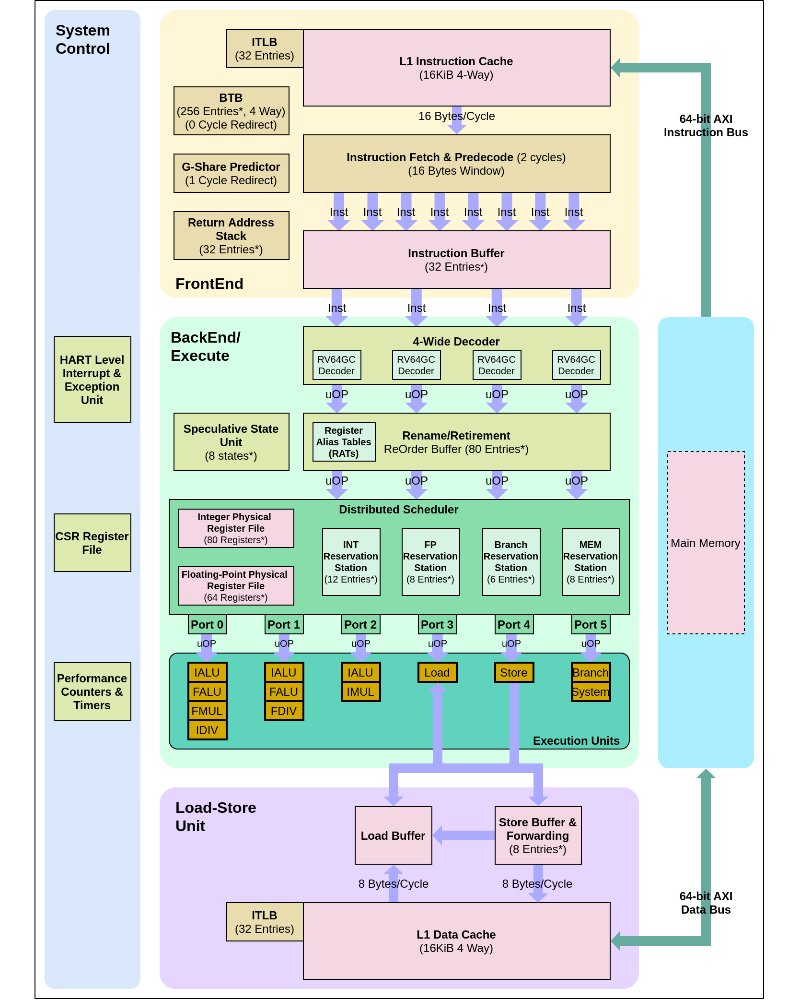
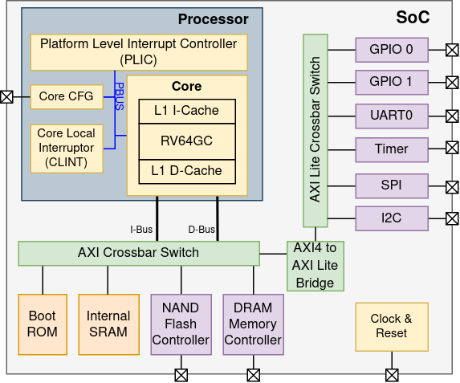

# I2SRV64-SS (64-bit Superscalar Out-of-Order RISC-V Processor)

This is a synthesizable and parameterizable RV64GC RISC-V core written in the Verilog hardware construction language, implemented and tested on Xilinx Virtex-7 FPGA VC707 Evaluation Kit. Created at  Reconfigurable Computation Lab, Department of Electronic System Engineering, Indian Institute of Science (IISc), Bengalure.

Processor core implements supervisory and user privilege levels of RISC-ISA, support booting Linux OS.

## Brief Description of Processor Core

The processor consists of nine pipeline stages: Fetch, Predecode, Checking, Decode, Rename, Dispatch, Issue, Execute and Retire. The initial seven stages of the pipeline are common to all instructions, while the number of cycles taken for execution can vary depending on the instruction. Instruction Fetch Unit (IFU), I-cache, and branch predictor hardware form the front-end. Results from Branch Target Buffer (BTB) and G-share algorithm based Direction Predictor (DP), along with the results from Branch Quick Decode, are used by Branch Checker (BC) to determine the direction and the target address of the branch instruction and redirect program counter. Return Address Stack (RAS) is used to get the next instruction address in case of return instructions. The fetch rate used in the design is 16 bytes/cycle ie, four to eight instructions depending on the presence of compressed instructions. Each half-word from the fetched instruction is grouped as an instruction bundle and, along with branch type, target address, direction information etc., are formed as an Instruction Buffer (IB) entry and written to multi-ported write through FIFO named Instruction Buffer (IB). Entries in the IB are read by the decode unit at a decode rate of 4 instruction/cycle and decoded into a standard uOP format for uniform processing in downstream units. Instruction dependent control signals like wait till empty, stall till retire are also encoded into uOP during this process. The Rename Unit renames architectural registers into physical registers to resolve write after write (WAW) and write after read (WAR) dependencies. Renaming is done using the Physical Register File (PRF) to store the data and various Register Alias Tables (RAT) to map logical registers to physical registers. During branch misprediction, this mapping from stored RAT will be restored. Dispatch unit writes the Renamed uOP to respective reservation station based on the availability of reservation station and also write the dispatched instruction to Re- order Buffer (ROB) for maintaining program order while retiring the instruction. Whenever one instruction is executed, the result will be broad-casted by wake-up bus so that reservation
stations can update the availability of data in the physical register present in the instructions in reservation stations. Instructions in reservation station with all operands available in the physical register are issued by issue unit to respective execution unit, which can be in out of order sequence. The current design splits the execution units into multiple functional units so that similar instruction types can execute simultaneously, if functional units are free as shown in Figure 1. Retire unit dequeues instructions that have completed execution from ROB in program order and updates retire RAT entry. Load store unit along with memory subsystem handles store and load operations. Store and load operations are handled in-order in the current design. Memory subsystem consists of I-cache, I-TLB, D-cache, and D-TLB. Virtual memory sup-
port as specified by the RISC-V privileged specification is implemented in the current design. Translation Lookaside Buffer (TLB) with 32 entries stores the recent virtual address to physical address translation. Both D-cache and I-cache are 16 KiB, 4-way set associative with a block size of 32 bytes, whereas TLB is implemented as a Content Addressable Memory. The System Control Unit controls the core. It has Control Status Register (CSR) file as specified by RISC-V ISA, custom CSRs, the logic for handling fence instruction, reservation for LR instruction, and Hart Level Interrupt Controller (HLIC) which handles the exceptions/ interrupts.

## Design Specification

- Processor Core
  - ISA: 64-bit RISC-V (RV64GC)
  - Implements User ISA Spec v20191213 and Privileged ISA Spec v20190608
  - Supports virtual memory and MMU (Sv39) mode
  - Atomic and compressed instructions support
- Micro-architecture
  - 4-wide issue, out-of-order superscalar processor
  - IEEE-754 Floating Point Unit
  - Fetch Rate: 16 Bytes/cycle
  - Decode/Rename/Dispatch/Retire Rate: 4 instructions/cycle.
  - Register Renaming: Full renaming using separate Physical Register File (PRF) and
    Rename Table
  - Reorder Buffer (ROB) for in-order instruction commit
  - Speculative tagging for fast branch misprediction recovery
  - synthesizable parameterized Verilog implementation
- Branch Prediction Unit
  - Branch Target Buffer (BTB)
  - G-Share based Direction Predictor.
  - Return Address Stack (RAS)
- Instruction Memory Subsystem
  - I-Cache (16 KiB)
    - 4-way set-associative
  -  I-TLB
    - Fully Associative Placement Policy
    -  Supports 3 level Page Table walking
- Data Memory Subsystem
  - Load and Store queues
  - D-Cache (16 KiB)
    - Virtual Index Physical Tag (VIPT)
    -  4-way Set Associative Cache
  - D-TLB
    - Fully Associative Placement Policy
    - Supports 3 level Page Table walking

## Core Configuration

- Fetch Rate: 16 bytes/cycle
- Decode/Rename/Dispatch/Retire Rate: 4 Instructions/cycle
- Issue Rate: 6 Instructions/cycle
- Number of speculative states: 8
- Number of Physical Registers: Integer (64), Floating-Point (48)
- Entries in Reservation Stations: Integer (12), Floating-Point (8), Branch (6), Memory (8)
- Number of Issue Requests: Integer (3), Floating-Point (2), Branch (1), Memory (2)
- Entries in Re-Order Buffer (ROB): 44
- Depth of Return Address Stack: 32
- Depth of Instruction Buffer: 32
- Entries in Store Buffer: 8
- Number of PMP Entries implemented: 4
- Global History Length: 8
- Branch Target Buffer: 1024 Entries (4-Way Set-Associative)
- Pattern History Table: 2048 Entries (Global History)

# SoC Architecture 

## Memory Map

|    Base    |    Top     |      Description       |   Bus   |
| :--------: | :--------: | :--------------------: | :-----: |
| 0x00001000 | 0x000013FF |    CoreCFG (1 KiB)     | Private |
| 0x00010000 | 0x00013FFF |    BootROM (16 KiB)    |   AXI   |
| 0x02000000 | 0x0200FFFF |     CLINT (64 KiB)     | Private |
| 0x0C000000 | 0x0CFFFFFF |     PLIC (16 MiB)      | Private |
| 0x10000000 | 0x1000FFFF | Internal SRAM (64 KiB) |   AXI   |
| 0x20000000 | 0x20000FFF |      UART (4 KiB)      | AXILite |
| 0x20010000 | 0x20010FFF |     GPIO0 (4 KiB)      | AXILite |
| 0x20020000 | 0x20020FFF |      I2C (4 KiB)       | AXILite |
| 0x20030000 | 0x20030FFF |     Timer (4 KiB)      | AXILite |
| 0x20050000 | 0x20050FFF |     GPIO1 (4 KiB)      | AXILite |
| 0x40000000 | 0x47FFFFFF | Flash Memory (128 MiB) |   AXI   |
| 0x80000000 | 0xBFFFFFFF |   DRAM Memory (1GiB)   |   AXI   |

##  Boot Options

| Boot Mode |            Description            |
| :-------: | :-------------------------------: |
|   0000    |      Info Mode                    |
|   0010    |       Boot from SD Card           |
|   0111    |   Boot From Flash to DRAM         |
|   0101    |   Boot From UART to Flash         |
|   0110    |   Boot from UART to DRAM          |

* Boot mode is selected based on status of DIP switches in VC707 evaluation board during power on.
* This ROM is loaded with Zeroth Stage BootLoader (ZSBL) which supports the loading binary to inter-
  nal SRAM, DRAM using XMODEM file transfer protocol through UART and executing the
  program from SRAM or DRAM.
